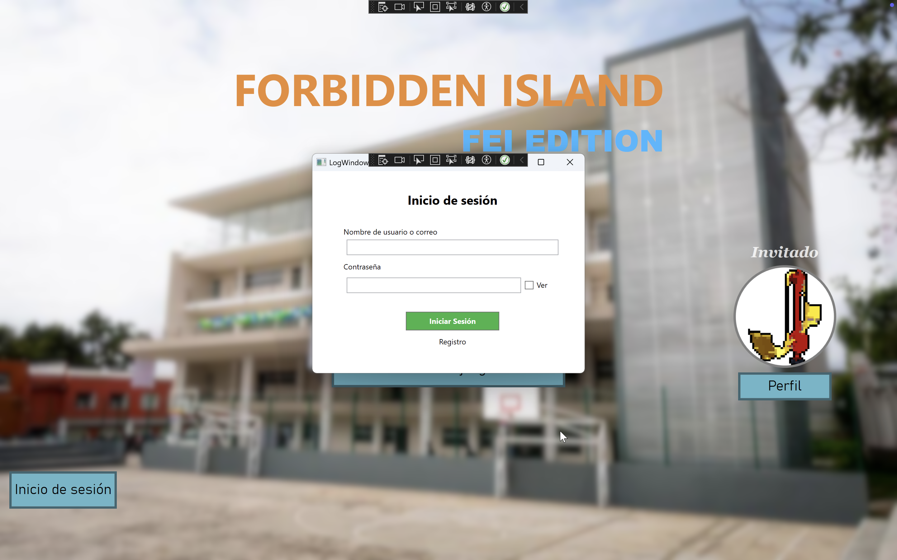
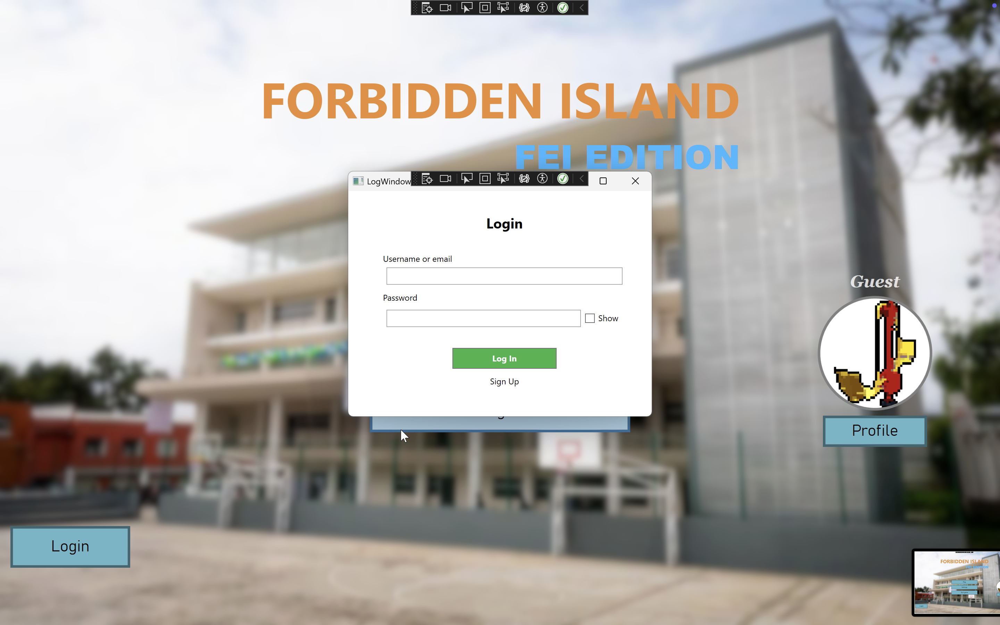
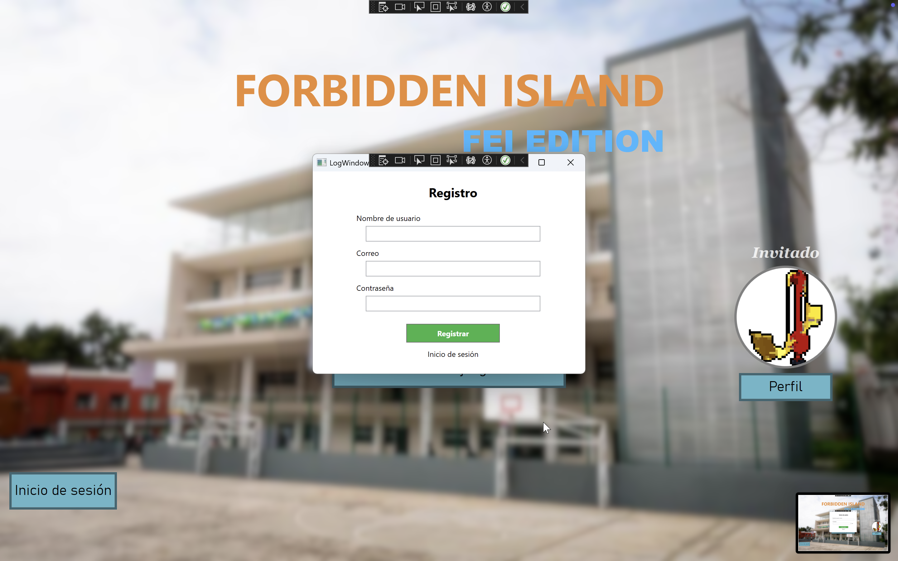
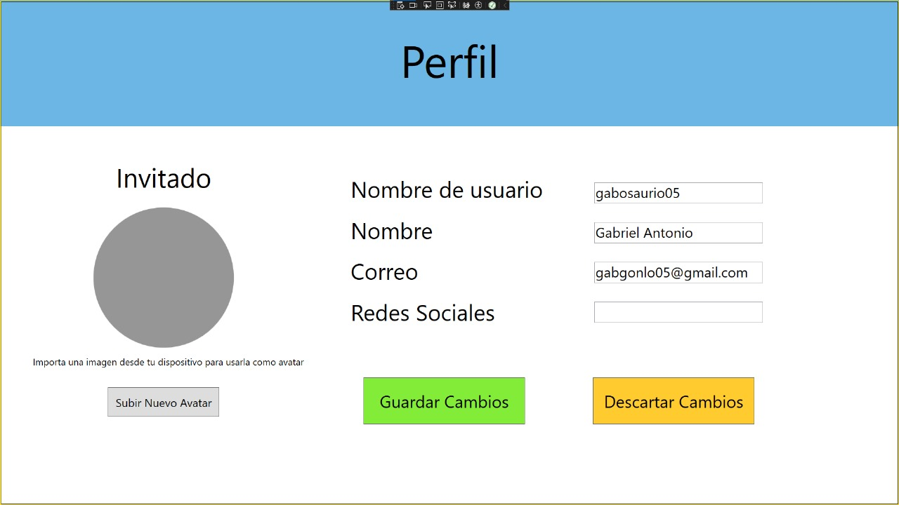
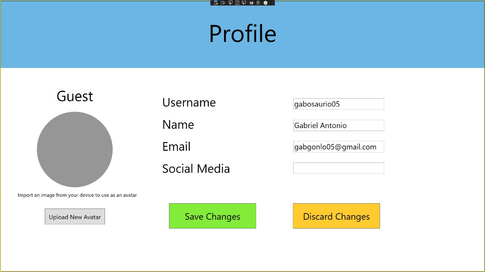
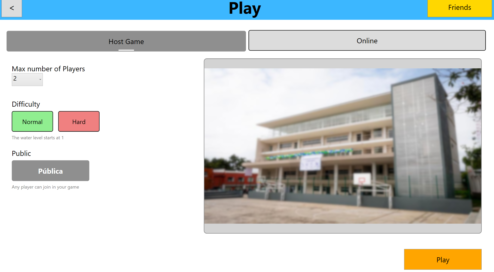

== Avances 26 de septiembre de 2025

=== Casos de uso
- Forbbiden.Server
- Iniciar sesión como servicio
- Registrar usuario como servicio
- Editar perfil de usuario como servicio
- Menú principal (nuevas funciones)
- Forbbiden.Test

=== Porcentajes de contribución
- Leonardo 50%
- Gabriel 50%

=== Forbbiden.Server

=== Iniciar sesión como servicio
Responsable: Gabriel

.Inicio de sesión en español

.Inicio de sesión en inglés

=== Registrar usuario como servicio
Responsable: Gabriel

.Registro de usuario en español

.Registro de usuario en inglés

=== Editar perfil de usuario como servicio
Responsable: Gabriel

.Página de perfil en español

.Página de perfil en inglés

=== Menú principal (Nuevas funciones)
Responsable: Leonardo

.Menú principal en español

.Menú principal en inglés
image::images/screenshots/version2/mainpage-en.png[Menú principal en inglés, width=600, align=left]

=== Nuevo juego (Nuevas funciones)
Reponsable: Leonardo

.Nuevo juego en español

.Nuevo juego en inglés

=== Forbbiden.Test
Responsable: Leonardo y Gabriel

==== TestProfileManager

=== Uso de IA

==== Gabriel

* Uso de ChatGPT para entender mejor qué hacía cada elemento o control de app.xaml, app.config y cómo configurarlos para que Forbbiden.Server pudiera correr.
* Uso de ChatGPT para entender el modelo Cliente-Servidor.
* Uso de ChatGPT para comprender cómo maneja Entity Framework los datos y las consultas
* Uso de ChatGPT para aprender a usar Visual Studio 2022 y su particular forma de refactorizar (como renombrar archivos o namespaces)
* Uso de ChatGPT para consultar los métodos de los elementos de WPF (como los de Ellipse, CheckBox, TextBox, etc)
** Aquí incluyo el solicitar una Cheat-Sheet de los generales de los elementos (le pedí que los comparara con los de JavaFX para entender un poco mejor)

Nota: No uso la IA para que resuelva los problemas que surgen, la uso para entenderlos y yo poder encontrar una solución, así que generalmente le pregunto cosas como "Qué hace este fragmento del App.config" o "Leí sobre esta forma de hacer consultas con EF, cuál es la diferencia con esta otra" o cosas por el estilo. Me gusta leer primero documentación o soluciones de algún usuario en foros y ya después si me agrada alguna pero no la entiendo al 100% le pido a ChatGPT que me explique lo que no entiendo, esto con la intención de usarlo como una herramienta y no como una solución.

==== Leonardo
* Uso de ChatGPT para entender qué herramientas se suelen utilizar para implementar ciertas funcionalidades o abordar aspectos de UI.
* Uso de ChatGPT para aprender cómo traducir prototipos visuales a código XAML en WPF.
* Uso de ChatGPT para la generación de estilos de la interfaz
** Para diseñar y personalizar los estilos de los botones.
** Para poder conseguir la apariencia prevista durante los prototipos.
** Para investigar cómo se suelen organizar los temas visuales de la aplicación.
** Para explorar buenas prácticas de UI y consistencia en la apariencia.
