== Avances 26 de septiembre de 2025

=== Casos de uso
- Forbbiden.Server
- Iniciar sesión como servicio
- Registrar usuario como servicio
- Editar perfil de usuario como servicio
- Menú principal (nuevas funciones)
- Forbbiden.Test

=== Porcentajes de contribución
- Leonardo 50%
- Gabriel 50%

=== Forbbiden.Server

=== Iniciar sesión como servicio
Responsables: Gabriel y Leonardo

Gabriel: Lógica con el servidor

Lenoardo: Actualización de GUI

*Objetivos para la próxima iteración:* Mejorar la interfaz de usuario para que se vea más bonita

.Inicio de sesión en español
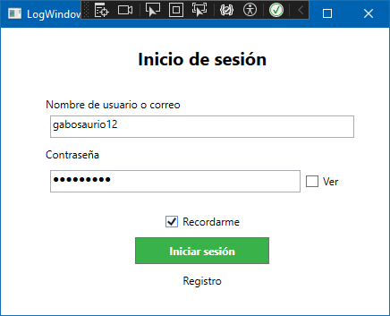
.Inicio de sesión en inglés
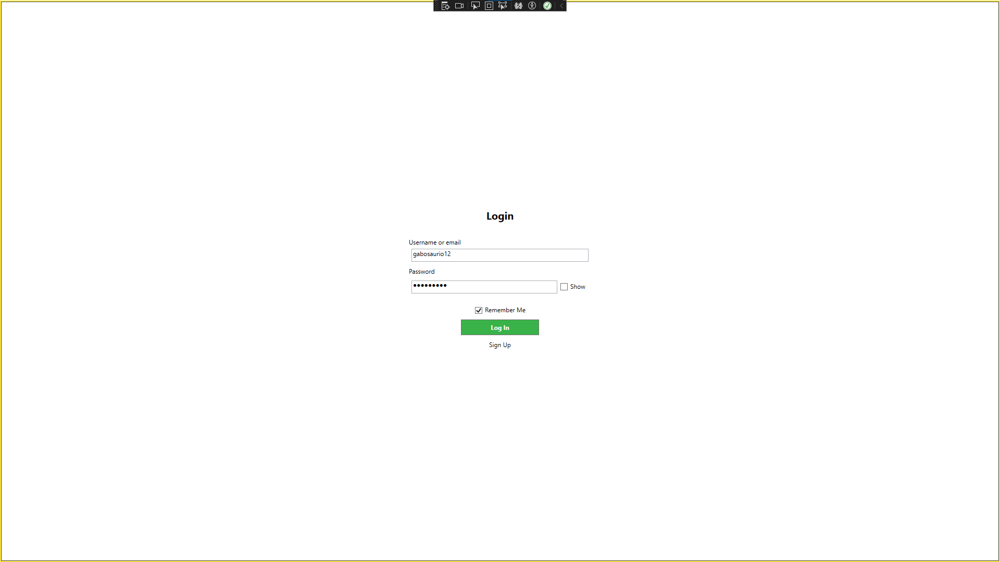

==== Código del cliente

[source,c#]
----

public partial class LoginPage : Page
{
    private static readonly ILog log = LogManager.GetLogger(typeof(LoginPage));

    private void BtnLogin_Click(object sender, RoutedEventArgs e)
    {
        ResetFieldColors();

        var client = new ProfileManagerClient();

        Player searchPlayer = client.GetPlayerByUsername(txtBUsername.Text);

        if (searchPlayer == null)
        {
            MessageBox.Show("El nombre de usuario no existe.");
            txtBkUser.Foreground = Brushes.Red;
        }
        else
        {
            string password = "";
            if (chkPassword.IsChecked == true)
            {
                password = txtBPasswordVisible.Text;
            }
            else
            {
                password = pwdBPassword.Password;
            }
            
            if (BCrypt.Net.BCrypt.Verify(password, searchPlayer.PlayerPassword))
            {
                if (client.Login(searchPlayer))
                {

                    Properties.Settings.Default.rememberLogin = chkRememberMe.IsChecked == true;
                    Properties.Settings.Default.Save();

                    var logWindow = Window.GetWindow(this) as LogWindow;
                    logWindow?.Close();
                    log.Info($"Usuario '{searchPlayer.PlayerUsername}' logged in.");
                }
                else
                {
                    log.Warn($"Login failed for user '{searchPlayer.PlayerUsername}'.");
                    MessageBox.Show("Error al iniciar sesión. Por favor, inténtelo de nuevo.");
                }
            }
            else
            {
                txtBkPassword.Foreground = Brushes.Red;
                MessageBox.Show("Contraseña incorrecta");
            }
        }
    }
}

----

==== Código del servidor

[source,c#]
----

[ServiceBehavior(InstanceContextMode = InstanceContextMode.Single)]
public class ProfileManager : IProfileManager
{
    private static readonly ILog log = LogManager.GetLogger(typeof(ProfileManager));

    public bool Login(Contracts.Player player)
    {
        bool success = true;
        using (var db = new Forbbiden_FEIEntities())
        {
            db.LoginPlayer.Add(new LoginPlayer
            {
                login_player_id = player.PlayerId,
            });
            try
            {
                db.SaveChanges();
            }
            catch (DbEntityValidationException ex)
            {
                success = false;
                log.Error("ProfileManager.cs", ex);
            }
            catch (DbUpdateException ex)
            {
                success = false;
                log.Error("ProfileManager.cs", ex);
            }
            catch (Exception ex)
            {
                success = false;
                log.Error("ProfileManager.cs", ex);
            }
        }

        return success;
    }
        
    public Contracts.Player GetPlayerByUsername(string username)
    {
        using (var db = new Forbbiden_FEIEntities())
        {
            var playerResult = db.Player.FirstOrDefault(u => u.player_username == username);
            if (playerResult != null)
            {
                return new Contracts.Player
                {
                    PlayerId = playerResult.player_id,
                    PlayerUsername = playerResult.player_username,
                    PlayerPassword = playerResult.player_password,
                    PlayerEmail = playerResult.player_email
                };
            }
            return null;
        }
    }
}

----

=== Registrar usuario como servicio

Responsables: Gabriel y Leonardo

Gabriel: Lógica con el servidor

Lenoardo: Actualización de GUI

*Objetivos para la próxima iteración:* Mejorar la interfaz de usuario para que se vea más bonita

.Registro de usuario en español
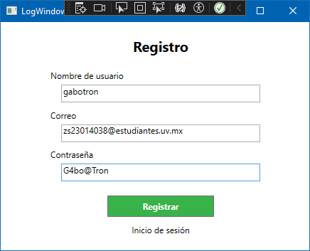
.Registro de usuario en inglés
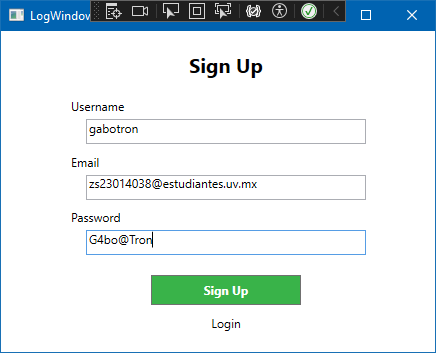

==== Código del cliente

[source,c#]
----

public partial class SignupPage : Page
{
    private static readonly ILog log = LogManager.GetLogger(typeof(SignupPage));

    private bool ValidatePlayer(ref Player player, ProfileManagerClient client)
    {
        bool isValid = true;

        if (!ValidatePassword(player.PlayerPassword))
        {
            MessageBox.Show("La contraseña debe tener al menos 8 caracteres, una mayúscula, una minúscula, un número y un carácter especial.");
            isValid = false;
        }
        if (string.IsNullOrWhiteSpace(player.PlayerUsername))
        {
            MessageBox.Show("El nombre de usuario no puede estar vacío.");
            isValid = false;
        }
        if (player.PlayerUsername.Contains(" "))
        {
            MessageBox.Show("El nombre de usuario no puede contener espacios.");
            isValid = false;
        }
        if (!client.IsUsernameAvailable(player.PlayerUsername))
        {
            MessageBox.Show("El nombre de usuario ya está en uso.");
            isValid = false;
        }
        if (!client.ValidateEmail(player.PlayerEmail))
        {
            MessageBox.Show("El correo electrónico es inválido o ya está en uso.");
            isValid = false;
        }
       
        return isValid;
    }

    private void SignupButton_Click(object sender, RoutedEventArgs e)
    {
        var client = new ProfileManagerClient();

        var player = new Player
        {
            PlayerUsername = txtBUsername.Text,
            PlayerEmail = txtBEmail.Text,
            PlayerPassword = txtBPassword.Text
        };

        if (ValidatePlayer(ref player, client))
        {
            player.PlayerPassword = BCrypt.Net.BCrypt.HashPassword(player.PlayerPassword);
            if (client.SignUp(player))
            {
                log.Info($"Usuario {player.PlayerUsername} sent.");
                MessageBox.Show("Usuario registrado exitosamente.");
                NavigationService.Navigate(new LoginPage());
            }
            else
            {
                MessageBox.Show("Error al registrar el usuario. Inténtelo de nuevo más tarde.");
            }
        }         
    }
}

----

==== Código del servidor

[source,c#]
----

[ServiceBehavior(InstanceContextMode = InstanceContextMode.Single)]
public class ProfileManager : IProfileManager
{
    private static readonly ILog log = LogManager.GetLogger(typeof(ProfileManager));

    public bool ValidateEmail(string email)
    {
        if (string.IsNullOrWhiteSpace(email))
        {
            return false;
        }
        if (email.Contains("@"))
        {
            using (var db = new Forbbiden_FEIEntities())
            {
                var emailResult = db.Player.FirstOrDefault(p => p.player_email == email);
                return emailResult == null;
            }
        }

        return false;
    }

    public bool IsUsernameAvailable(string username)
    {
        using (var db = new Forbbiden_FEIEntities())
        {
            try
            {
                var playerResult = db.Player.FirstOrDefault(u => u.player_username == username);
                return playerResult == null;
            }
            catch (Exception ex)
            {
                log.Error("ProfileManager.cs", ex);
                return false;
            }
        }
    }

    public bool SendEmail(string email)
    {
        bool success = true;
        string receiver = email;
        string emisor = "forbbidenislandfei@gmail.com";
        MailMessage message = new MailMessage(emisor, receiver);
        message.Subject = "Register confirmation";
        message.Body = "Your account has been succesfully created, welcome to Forbbiden Island FEI Edition. Enjoy the adventure!";
        SmtpClient client = new SmtpClient("smtp.gmail.com");
        client.Port = 587;
        string emailCode = Properties.Settings.Default.emailCode;
        client.Credentials = new System.Net.NetworkCredential(emisor, emailCode);
        client.EnableSsl = true;

        try
        {
            client.Send(message);
        }
        catch (Exception ex)
        {
            log.Error("ProfileManager.cs", ex);
            success = false;
        }

        return success;
    }

    public bool SignUp(Contracts.Player player)
    {
        bool success = true;
        using (var db = new Forbbiden_FEIEntities())
        {
            Player newPlayer = new Player
            {
                player_username = player.PlayerUsername,
                player_password = player.PlayerPassword,
                player_email = player.PlayerEmail
            };
            try
            {
                db.Player.Add(newPlayer);
                db.SaveChanges();
                SendEmail(newPlayer.player_email);
            }
            catch (DbEntityValidationException ex)
            {
                log.Error("ProfileManager.cs", ex);
                success = false;
            }
            catch (DbUpdateException ex)
            {
                log.Error("ProfileManager.cs", ex);
                success = false;
            }
        }
        return success;
    }
}

----

=== Editar perfil de usuario como servicio
Responsable: Gabriel

.Página de perfil en español
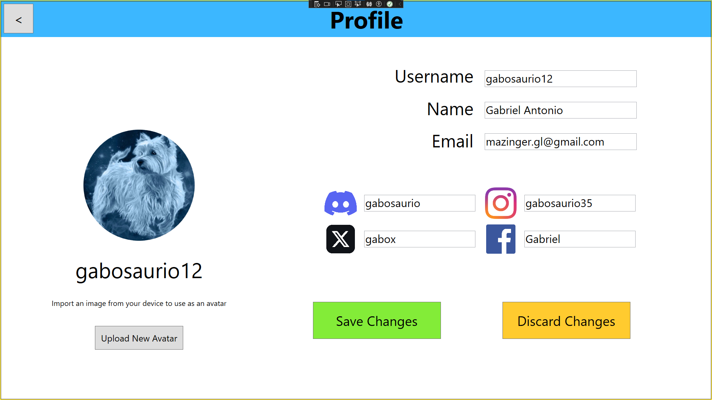
.Página de perfil en inglés
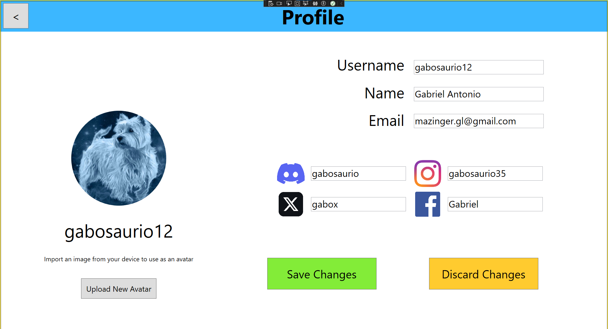
.Subir avatar en español
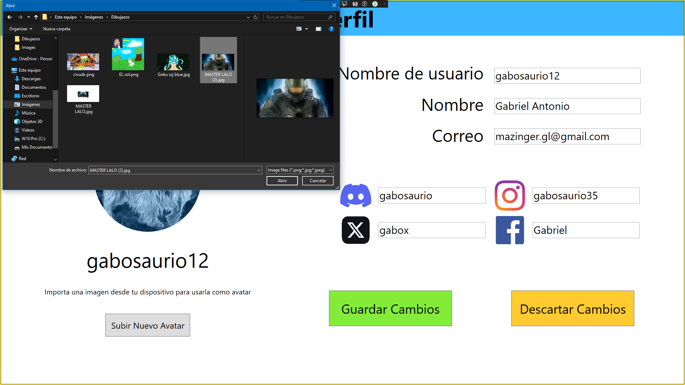
.Subir avatar en inglés
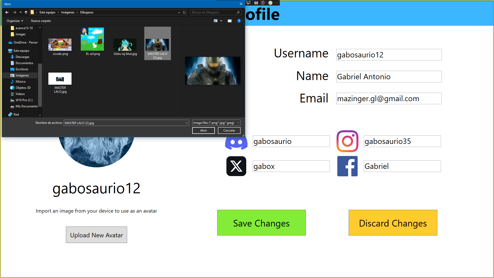

=== Menú principal (Nuevas funciones)
Responsable: Leonardo

.Menú principal en español
image::images/screenshots/avance13-10/mainpage-es.png[Menú principal en español, width=600, align=left]
.Menú principal en inglés
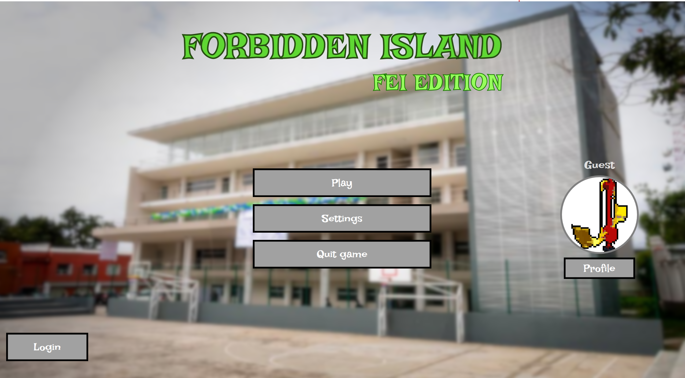
.Menú principal loggeado en español
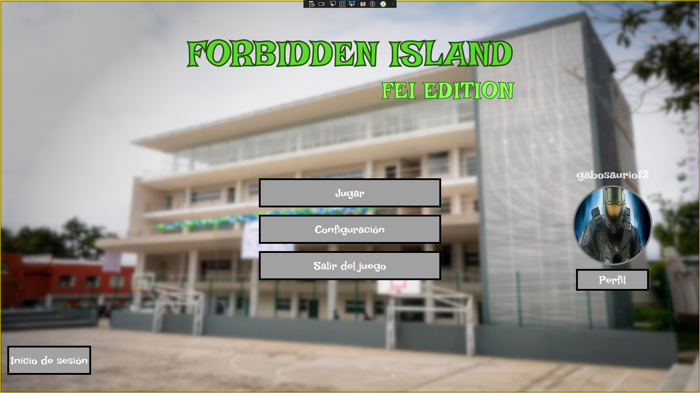
.Menú pirncipal loggeado en inglés

=== Nuevo juego (Nuevas funciones)
Reponsable: Leonardo

.Nuevo juego en español
image::images/screenshots/version2/newgame-es.png[Nuevo juego en español, width=600, align=left]
.Nuevo juego en inglés
image::images/screenshots/version2/newgame-en.png[Nuevo juego en inglés, width=600, align=left]

=== Forbbiden.Test
Responsable: Gabriel

==== TestProfileManager

Para más detalle sobre las pruebas ver el reporte de casos de prueba.

.Pruebas
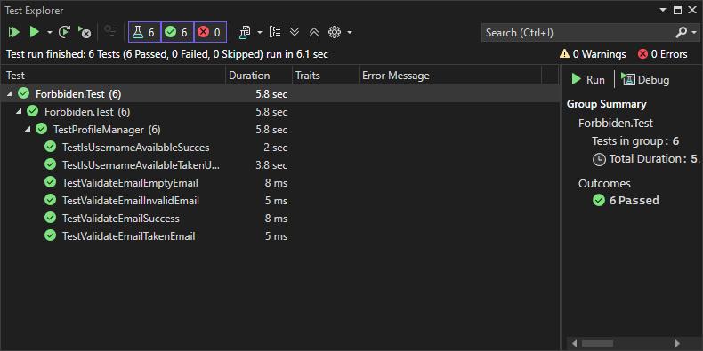

===== Código de pruebas

[source,c#]
----

[TestFixture]
public class TestProfileManager
{

    [OneTimeSetUp]
    public void Setup()
    {
        var client = new ProfileManagerClient();

        Player player = new Player
        {
            PlayerUsername = "testUser",
            PlayerPassword = "T3st_pass",
            PlayerEmail = "testuser@email.net"
        };

        client.SignUpAsync(player);
    }

    [OneTimeTearDown]
    public void TearDown()
    {
        var client = new ProfileManagerClient();
        string username = "testUser";
        client.DeletePlayerByUsernameAsync(username);
    }

    [Test]
    public async Task TestValidateEmailSuccess()
    {
        var client = new ProfileManagerClient();
        string email = "randomEmail@email.net";

        var result = await client.ValidateEmailAsync(email);
        Assert.That(result, Is.True, "result should be true");
    }

    [Test]
    public async Task TestValidateEmailInvalidEmail()
    {
        var client = new ProfileManagerClient();
        string email = "randomEmail.com";

        var result = await client.ValidateEmailAsync(email);
        Assert.That(result, Is.False, "result should be false");
    }

    [Test]
    public async Task TestValidateEmailEmptyEmail()
    {
        var client = new ProfileManagerClient();
        string email = "";

        var result = await client.ValidateEmailAsync(email);
        Assert.That(result, Is.False, "result should be false");
    }

    [Test]
    public async Task TestValidateEmailTakenEmail()
    {
        var client = new ProfileManagerClient();
        string email = "testuser@email.net";

        var result = await client.ValidateEmailAsync(email);
        Assert.That(result, Is.False, "result should be false");
    }

    [Test]
    public async Task TestIsUsernameAvailableSucces()
    {
        var client = new ProfileManagerClient();
        string username = "testUser098";

        var result = await client.IsUsernameAvailableAsync(username);
        Assert.That(result, Is.True, "result should be true");
    }

    [Test]
    public async Task TestIsUsernameAvailableTakenUsername()
    {
        var client = new ProfileManagerClient();
        string username = "testUser";

        var result = await client.IsUsernameAvailableAsync(username);
        Assert.That(result, Is.False, "result should be false");
    }
}

----

=== Uso de IA

==== Gabriel

* Uso de ChatGPT para entender mejor qué hacía cada elemento o control de app.xaml, app.config y cómo configurarlos para que Forbbiden.Server pudiera correr.
* Uso de ChatGPT para entender el modelo Cliente-Servidor.
* Uso de ChatGPT para comprender cómo maneja Entity Framework los datos y las consultas
* Uso de ChatGPT para aprender a usar Visual Studio 2022 y su particular forma de refactorizar (como renombrar archivos o namespaces)
* Uso de ChatGPT para consultar los métodos de los elementos de WPF (como los de Ellipse, CheckBox, TextBox, etc)
** Aquí incluyo el solicitar una Cheat-Sheet de los generales de los elementos (le pedí que los comparara con los de JavaFX para entender un poco mejor)

Nota: No uso la IA para que resuelva los problemas que surgen, la uso para entenderlos y yo poder encontrar una solución, así que generalmente le pregunto cosas como "Qué hace este fragmento del App.config" o "Leí sobre esta forma de hacer consultas con EF, cuál es la diferencia con esta otra" o cosas por el estilo. Me gusta leer primero documentación o soluciones de algún usuario en foros y ya después si me agrada alguna pero no la entiendo al 100% le pido a ChatGPT que me explique lo que no entiendo, esto con la intención de usarlo como una herramienta y no como una solución.

==== Leonardo

* Uso de ChatGPT para entender qué herramientas se suelen utilizar para implementar ciertas funcionalidades o abordar aspectos de UI.
* Uso de ChatGPT para aprender cómo traducir prototipos visuales a código XAML en WPF.
* Uso de ChatGPT para la generación de estilos de la interfaz
** Para diseñar y personalizar los estilos de los botones.
** Para poder conseguir la apariencia prevista durante los prototipos.
** Para investigar cómo se suelen organizar los temas visuales de la aplicación.
** Para explorar buenas prácticas de UI y consistencia en la apariencia.
