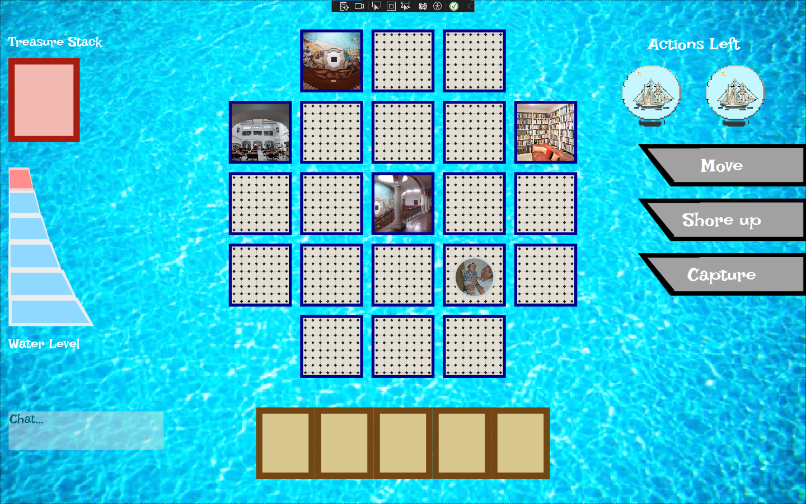
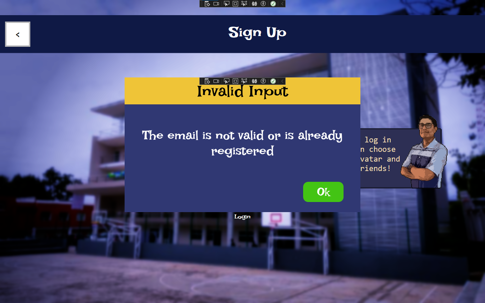
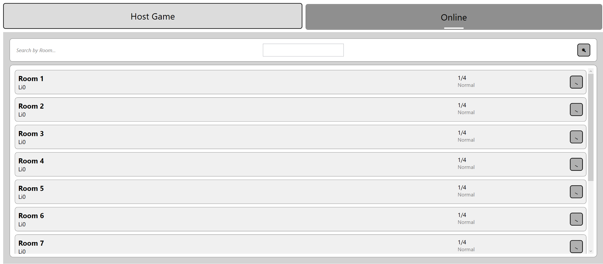
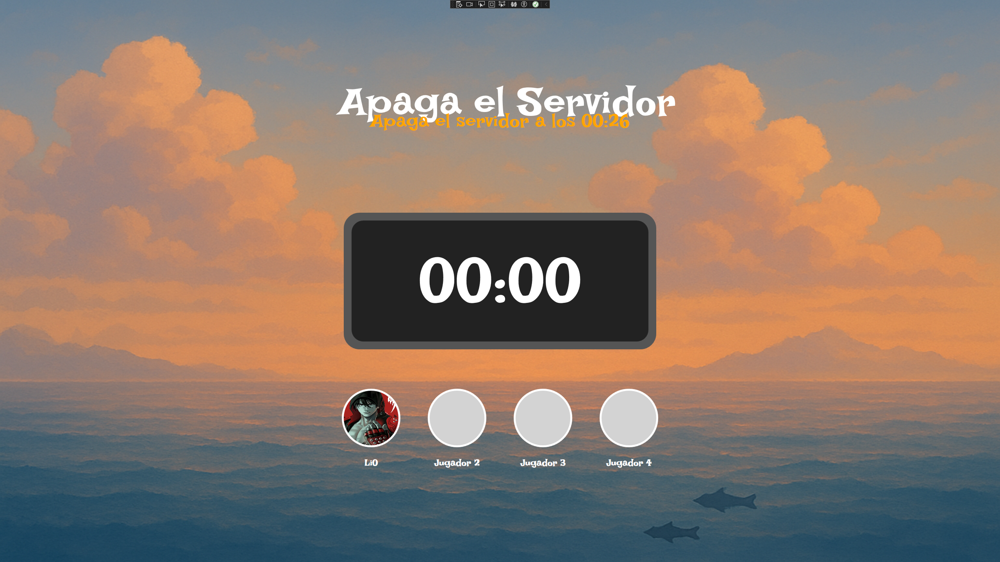
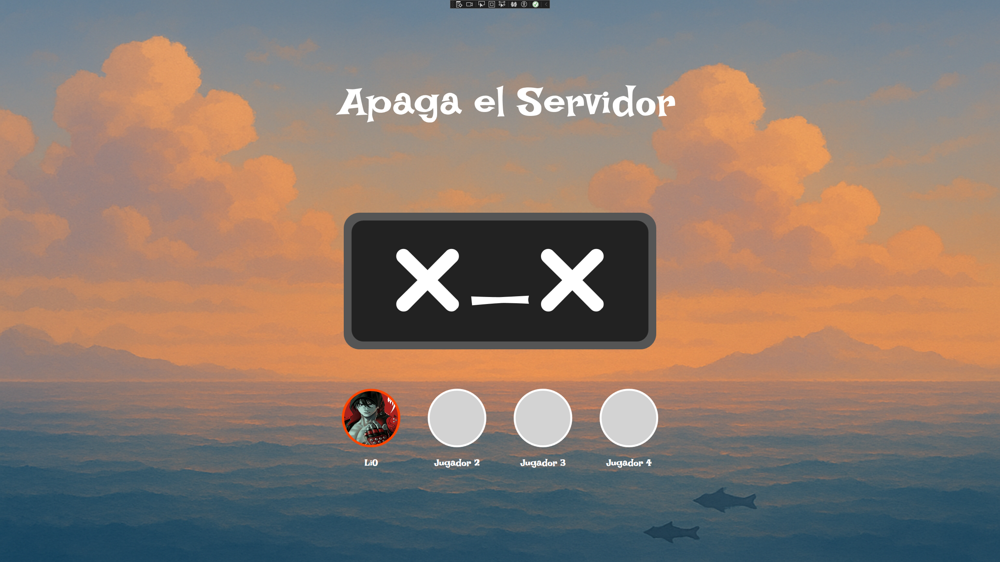
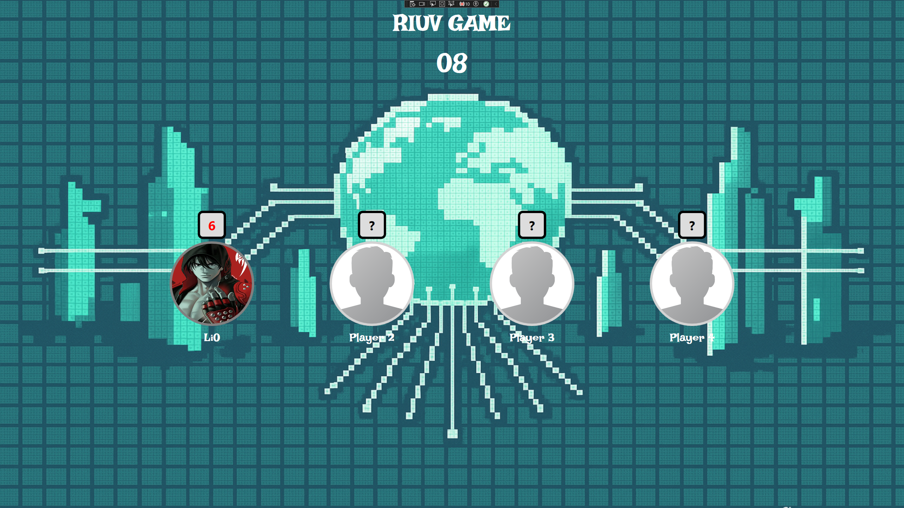

== Avances 11 de noviembre de 2025

=== Casos de uso
* Entrar a partida (GUI)
* Minijuego Detener el Servidor
* Minijuego Conectarse a la RIUV
* Unirse a partida 
* Tomar una carta
* Moverse
* Pruebas
* NotificationWindow

=== Porcentajes de contribución
- Leonardo 50%
- Gabriel 50%

=== Forbbiden.Server

=== Servicio de creación de juegos 
Responsables:
* Leonardo: Lógica con el servicio

=== Servicio de Juegos 
Responsables:
* Leonardo: Lógica con el servicio

=== Entrar a partida (GUI)

Responsable: Gabriel

Se construyó la parte visual de cuando un jugador entra a una partida, que aparezca su avatar y acciones disponibles.

=== NotificationWindow

Una ventana emergente que informa al usuario algún evento.

=== Unirse a juego actualización de GUI y funcionalidad 
* Responsable: Leonardo

.Estado inicial del juego

=== Minijuego Detener el Servidor
* Responsable: Leonardo

.Estado inicial del juego

.Error del Servidor

=== Minijuego Iniciar Sesión en la RIUV
* Reponsable: Leonardo

.Riuv Login Error

