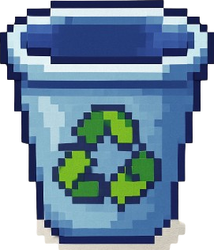
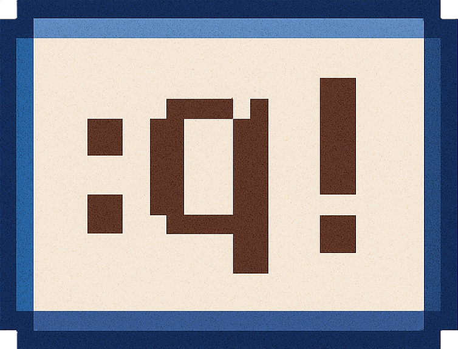

== Instructivo

=== Forbidden Island FEI Edition

La FEI ha sido un foco del conocimiento tecnológico e informático, pero antes de ser el cuartel de los ingenieros de software fue el refugio de una cultura más antigua, una cultura mística: los _Informáticos_. Cuenta la leyenda que los _Informáticos_ tenían la habilidad de controlar los cuatro pilares de la unidad mediante cuatro tesoros místicos.

Se dice que tenían un tesoro para vigilar los cielos y las redes inalámbricas: El *Peluche de Lucio*. Un tesoro para controlar el acceso a la FEI: La *Tarjeta del Estacionamiento*. Un tesoro para tener acceso ilimitado a las instalaciones: Las *Llaves de cubículos* y finalmente, el más poderoso, una guía para escribir las sagradas escrituras sin romperlas ni dañarlas (si lo leían y usaban correctamente): El *Clean Code*.

Como estos tesoros podían usarse para causar un daño catastrófico al mundo si caían en las manos de los adversarios, los _Informáticos_ decidieron esconder los tesoros en la FEI y programaron un EventHandler para que si alguien intentaba robarlos la FEI comenzara a hundirse.

Han pasado muchos años desde que desaparecieron de su imperio, algunos dicen que solo cambiaron de nombre, otros que evolucionaron y consiguieron nuevos conocimientos y habilidades, pero nadie tiene la certeza... solo se sabe que la FEI fue olvidada... hasta ahora.

¿Será tu equipo el primero capaz de recuperar los tesoros y salir con vida de la temible FEI?

==== Resumen del juego

Tu party debe trabajar en equipo para evitar que la FEI se hunda, con el objetivo de conseguir suficiente tiempo para recuperar los cuatro tesoros místicos. Cuando los hayas capturado, debes volver a la _Entrada de la FEI_ y usar el clásico comando de escape (*:!q*) para ganar. Si la isla se hunde antes de que hayan podido rescatar los tesoros ¡Pierden!

==== Primer vistazo al juego

===== Juego como Invitado

Puedes jugar como invitado, aunque no lo recomendamos ya que pierdes varias funcionalidades como tener una lista de amigos, un nombre de usuario y un avatar.

===== Crear una cuenta

Si es la primera vez que juegas puedes crear una cuenta, en la página principal debes dar clic en "Iniciar Sesión" y luego en "Registrarse". Se te solicitarán tu nombre de usuario, correo electrónico y una contraseña que deberá cumplir con lo siguiente:

* Al menos 8 caracteres

* Al menos una letra **MAYÚSCULA**

* Al menos una letra **minúscula**

* Al menos un **número**

* Al menos un caracter especial (! @ # $ % & _)

===== Agregar amigos

Para agregar un amigo deberás saber su nombre de usuario. Debes entrar desde la página principal a "Amigos" y dar clic a la _lupa_:

En la _barra de búsqueda_ ingresa el nombre de usuario de tu amigo y da clic al botón verde (*+*). Cuando tu amigo acepte tu solicitud de amistad aparecerá en tu lista de amigos.

===== Aceptar solicitudes de amistad

Cuando te envían una solicitud de amistad, en la página de "Amigos" aparece una notificación (foco verde que parpadea), si le das clic podrás ver las solicitudes de amistad que has recibido.

Para aceptar la solicitud debes dar clic al botón verde (*+*) y para rechazarla al rojo (*-*).

===== Ver el perfil de tus amigos

Si quieres ver el perfil de un amigo solo debes ir a la página de "Amigos" y dar clic en el botón de perfil del jugador que quieres ver.

===== Eliminar amigo

Si quieres eliminar a un amigo de tu lista de amigos solo debes ir a la página de "Amigos" y dar clic en el botón de eliminar del jugador que quieres eliminar.

==== Secuencia de Juego

Cada turno tiene las siguientes fases:

1. Hacer hasta 3 acciones.
2. Robar 2 cartas del mazo de tesoro (automático).
3. Robar tantas cartas de inundación como el nivel del agua (automático).

Como jugador solo debes concentrarte en hacer tus tres acciones.

===== 1. Hacer hasta 3 acciones

Cada turno puedes hacer máximo 3 acciones. Recuerda que es un juego en equipo, por lo que puedes usar el chat para comunicarte con tus compañeros para tomar las mejores decisiones.

Como mencionamos, puedes hacer 3 acciones, las cuales pueden ser cualquier combinaciónde las siguientes:

* Mover
* Asegurar
* Recuperar un tesoro

===== Mover

Puedes usando una o más acciones mover tu avatar a una casilla adyacente (arriba, abajo, izquierda o derecha). Puedes moverte a casillas inundadas pero no a las perdidas.

===== Asegurar

Puedes usando una o más acciones asegurar una casilla inundada adyacente (arriba, abajo, izquierda o derecha). Cuando aseguras una casilla, esta deja de estar inundada.

===== Recuperar Tesoro

Puedes usando una o más acciones recupearar un tesoro, para esto debes:

1. Estar en la casilla del tesoro (todas las casillas de tesoro tienen marco rojo).

2. Tener 2 cartas del tesoro que deseas recuperar.

3. Dar clic a la acción "Capturar tesoro".

Siguiendo estos pasos recuperarías el tesoro.

===== 2. Robar 2 cartas del mazo de tesoro

Este paso es automático, el juego te mostrará las cartas que robaste, debes precionar la _barra de espacio_ para ver la siguiente (si no reacciona dale clic a la carta y vuelve a intentarlo).

Solo puedes tener en tu mano hasta 5 cartas, si al robar tuvieras 6 debes o quedarte con las que tienes o descartar una de tu mano; el juego te preguntará lo que deseas hacer: Si descartas debes seleccionar una carta de tu mano para descartarla.

En este mazo es donde están las cartas de tesoro que necesitas para recuperar los tesoros, cartas de tesoro especiales y cartas de "¡Las aguas suben!".

===== Usar una carta de tesoro especiales

Hay dos cartas de tesoro que puedes usar, no te cuestan ninguna acción:

* Mitigation: Te permite asegurar *cualquier* casilla de todo el tablero.

* :q!: Te permite escapar de la isla, solo la puedes usar en la casilla de la Entrada de la FEI y debes tener los cuatro tesoros recuperados.

===== Cartas ¡Las aguas suben!

Cuando te sale una carta de este tipo el nivel del agua aumentará, reiniciando la pila de inundación.

===== 3. Robar tantas cartas de inundación como el nivel del agua

Este paso también es en automático, el juego (al igual que con las cartas de tesoro) te mostrará las cartas de inundación que salieron. Estas cartas significa que las casillas con la imagen de esa carta se inundarán (si ya estaban inundadas se perderán, por eso es importante que asegures las casillas que te importan).

Si la casilla en la que estás se pierde entras en modo de movimiento de emergencia, debes elegir una de las opciones que se te muestran para moverte pero si ya no tienes a donde ir significa que te vas a ahogar y ya no podrás jugar.

===== Fin del juego

===== Ganar el juego

Para ganar el juego debes haber recuperado todos los tesoros, moverte a la casilla de la _Entrada de la FEI_ (tiene un marco azul):

 y finalmente usar una carta de *:q!* para terminar el juego.

===== Perder el juego

Hay tres formas en las que puedes perder:

1. Si se hunde la casilla de la _Entrada de la FEI_.
2. Si se ahogan todos los jugadores.
3. Si se hunde la isla.