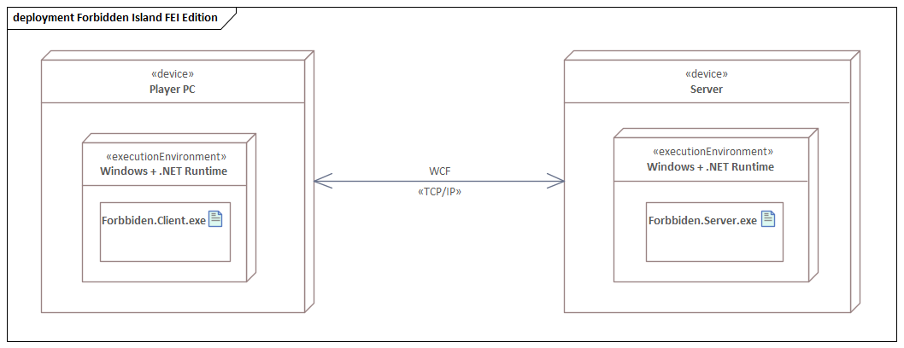

== Diagrama de Despliegue

El proyecto está construido sobre el modelo Cliente/Servidor, los cuales se comunican mediante TCP/IP usando WCF (porque estamos usando .NET como plataforma de desarrollo). Es importante destacar que el Server (por el alcance del proyecto) será una computadora personal (PC).

El diagrama muestra que tanto la computadora del jugador como el servidor usan Windows y corre la aplicación del cliente (_Forbbiden.Client_) o del servidor (_Forbbiden.Server_) sobre *.NET*.