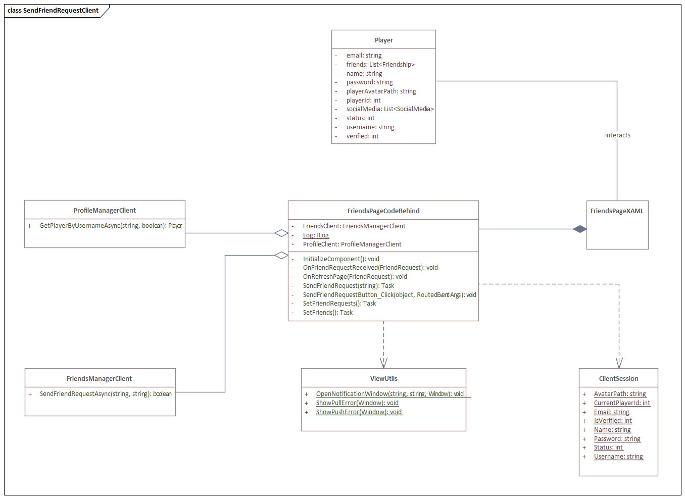
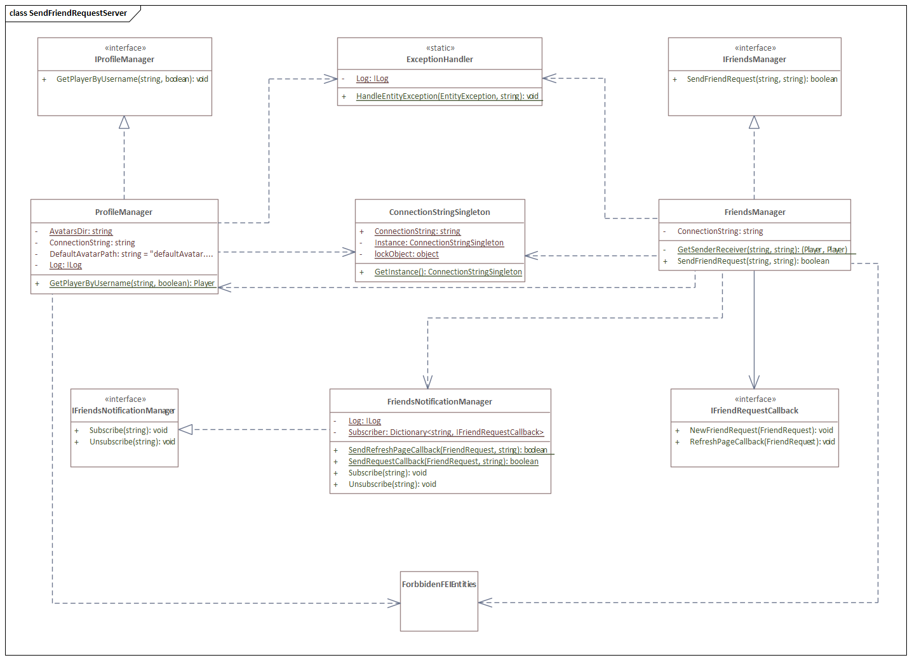
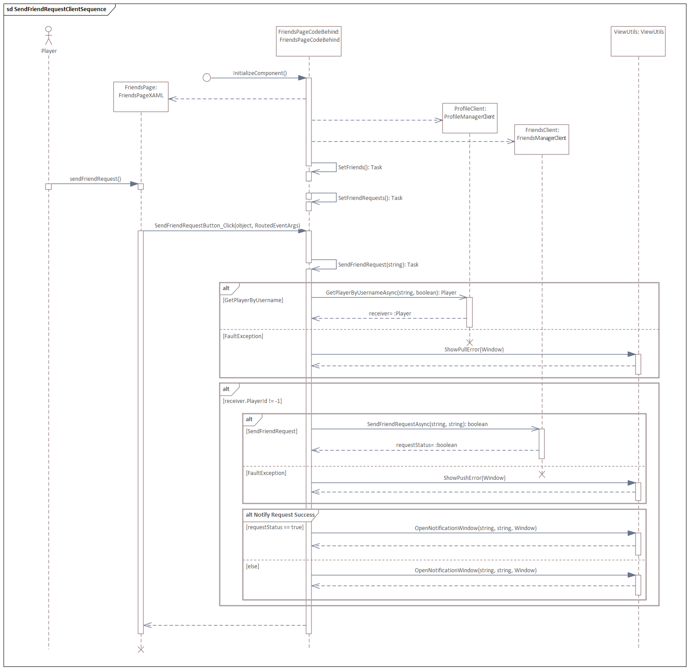
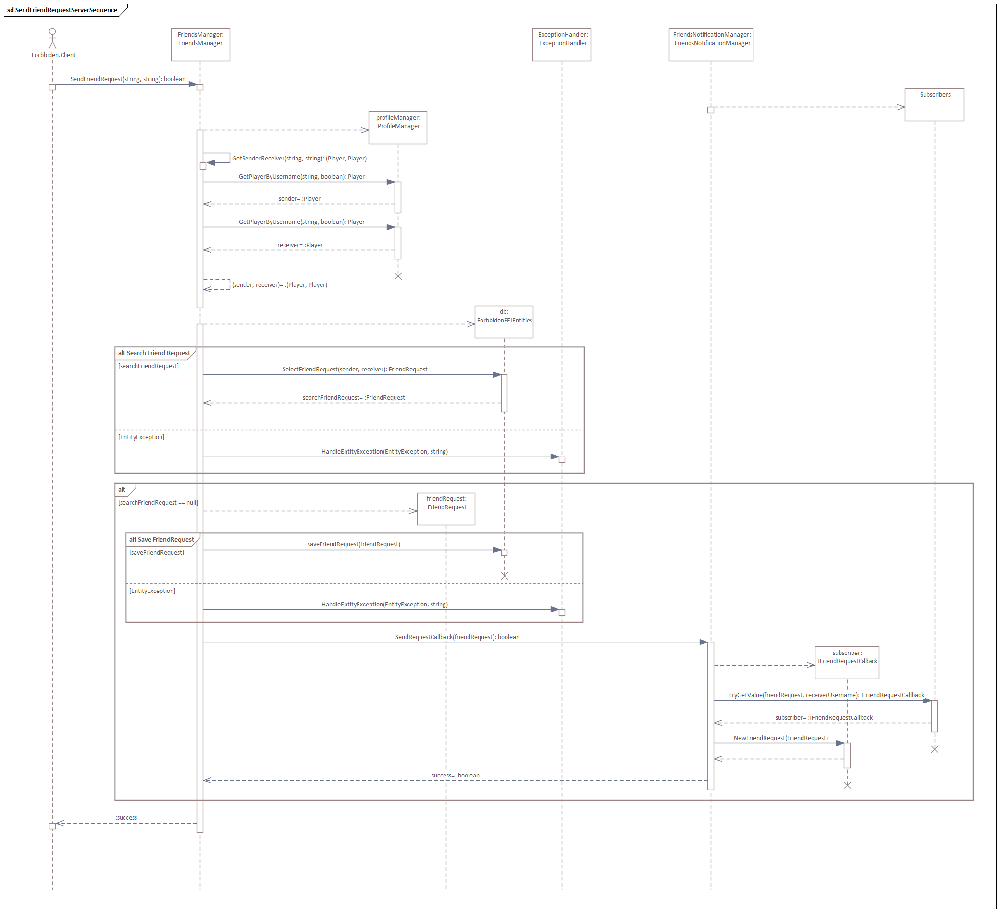

== Diagrama de Secuencia

Se realizó un diagrama de secuencia para comprender el flujo de un callback, se decidió usar el CU Enviar Solicitud de Amistad. Como todo diagrama de secuencia va acompañado de un diagrama de clases con las clases que usará, en este caso solo se modelaron los métodos que se usarían para evitar ruido y mejorar la legibilidad (sobre todo del lado del Servidor). Algunas partes del diagrama como declaraciones o tipos de objeto son de C# u herramientas que usamos (como Log4Net).

Estas son las clases del CU por parte del Cliente:

FriendsPageXAML es el archivo FriendsPage.xaml y el FriendsPageCodeBehind es el archivo FriendsPage.xaml.cs.

Y estas son las clases del CU por parte del Servidor:

Este es el diagrama de secuencia del lado del Cliente:

_ViewUtils.ShowPullError_ y _ViewUtils.ShowPushError_ son métodos que informan al jugador que hubo un error al conectarse al servidor e intentar consultar información o guardar información.

En _alt Notify Request Success_, cuando requestStatus es _true_ se abre una notificación informando al usuario que se envió con éxito la solicitud de amistad, de caso contrario [_else_] se informa al usuario que no se pudo enviar su solicitud de amistad.

Y este es el diagrama de secuencia del lado del Servidor:

Al momento que se hace _subscriber.NewFriendRequest()_ es cuando se hace el callback, actualizando así la interfaz gráfica a ese subscriptor.
