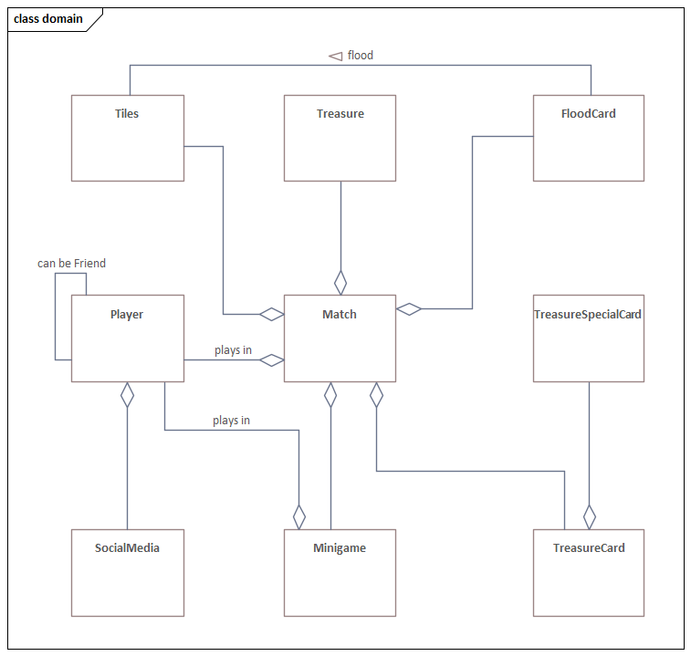
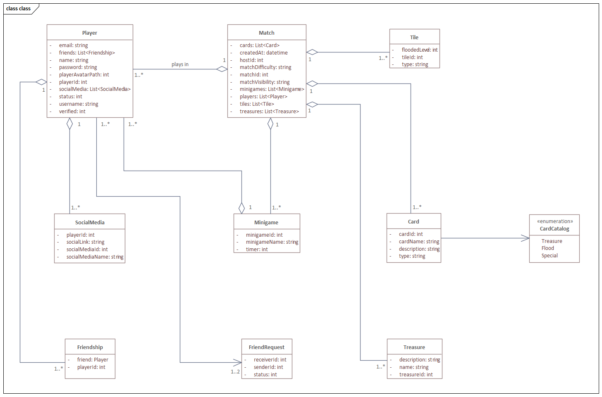
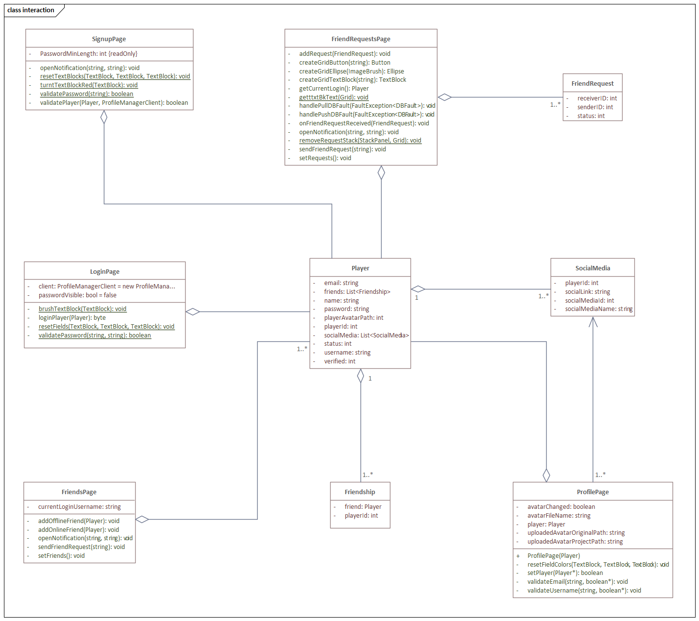

== Modelo de Dominio

El *MD* nos muestra las relaciones entre las entidades del juego.

.Modelo de dominio

== Diagrama de clases

Muestra el modelo de las clases del juego, definiendo relaciones, atributos y métodos.

.Diagrama de clases

== Diagrama de interacción

Muestra las relaciones entre las páginas de WPF (xaml) del juego, así como sus atributos y métodos mediante un diagrama de clases.

.Diagrama de interacción
