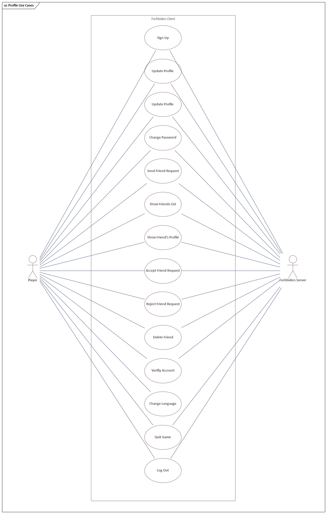
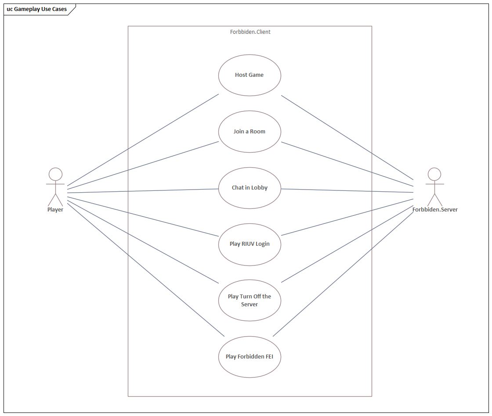

== Diagramas de Caso de Uso

Se identificaron los siguientes casos de uso para el Jugador que interactúa con el Cliente, siendo un actor secundario el Servidor.

.Casos de uso relacionados con el Perfil del Jugador

.Casos de uso relacionados con el Juego

